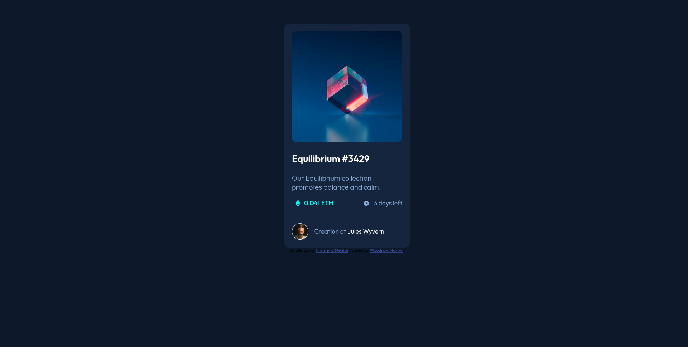

# nft-preview-card-component solution

This is a solution to the [NFT preview card component challenge on Frontend Mentor](https://www.frontendmentor.io/challenges/nft-preview-card-component-SbdUL_w0U). Frontend Mentor challenges help you improve your coding skills by building realistic projects. 

## Table of contents

- [Overview](#overview)
  - [The challenge](#the-challenge)
  - [Screenshot](#screenshot)
  - [Links](#links)
- [My process](#my-process)
  - [Built with](#built-with)
  - [What I learned](#what-i-learned)
  - [Continued development](#continued-development)
- [Author](#author)

**Note: Delete this note and update the table of contents based on what sections you keep.**

## Overview

### The challenge

Users should be able to:

- View the optimal layout depending on their device's screen size
- See hover states for interactive elements

### Screenshot

Screenshot of the final result.

### Links

- Solution URL: [https://github.com/wmartyr/nft-preview-card-component](https://github.com/wmartyr/nft-preview-card-component)
- Live Site URL: [Add live site URL here](https://your-live-site-url.com)

## My process

I started doing the HTML and then styled with CSS. I tried styling this one first using mobile widths and worked up to desktop sizes.

### Built with

- Semantic HTML5 markup
- CSS custom properties
- Flexbox
- Mobile-first workflow

### What I learned

This one took me a lot of googling and testing stuff out to get the hover effects right. 
First, I had to set the cards in a fixed width so I can fit the tint overlay exactly the right size over the image.
Then I had to use opacity to get it and the "eye" icon to appear when hovering. There might be a better way to do this than what I've done.

### Continued development

I think I need to have more practice in doing CSS effects. 
I also need to list down web pages where I've gotten a push in the right direction to complete this so I can acknowledge them in this document.

## Author

- Frontend Mentor - [@wmartyr](https://www.frontendmentor.io/profile/wmartyr)

